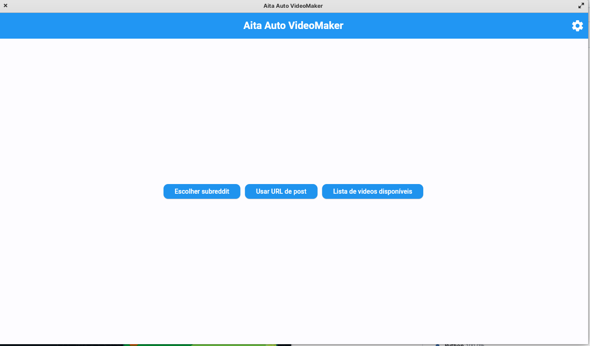
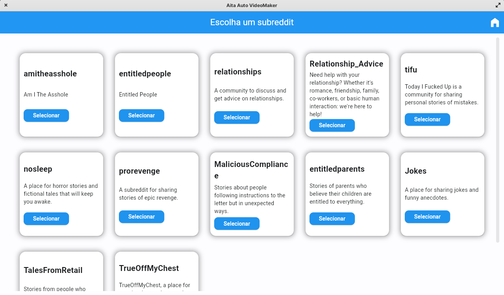
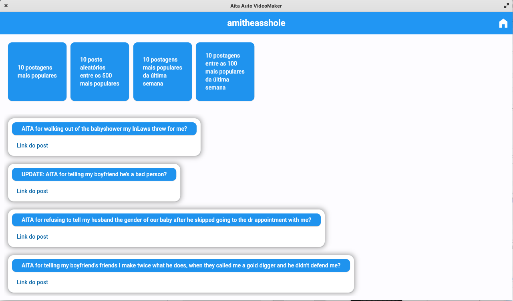
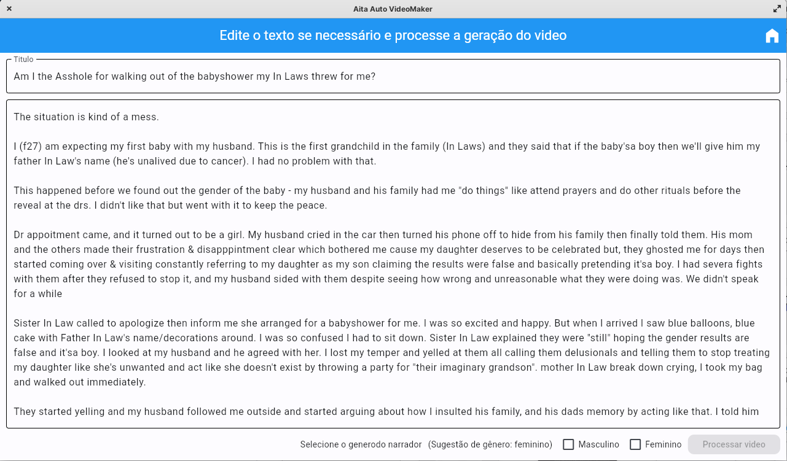
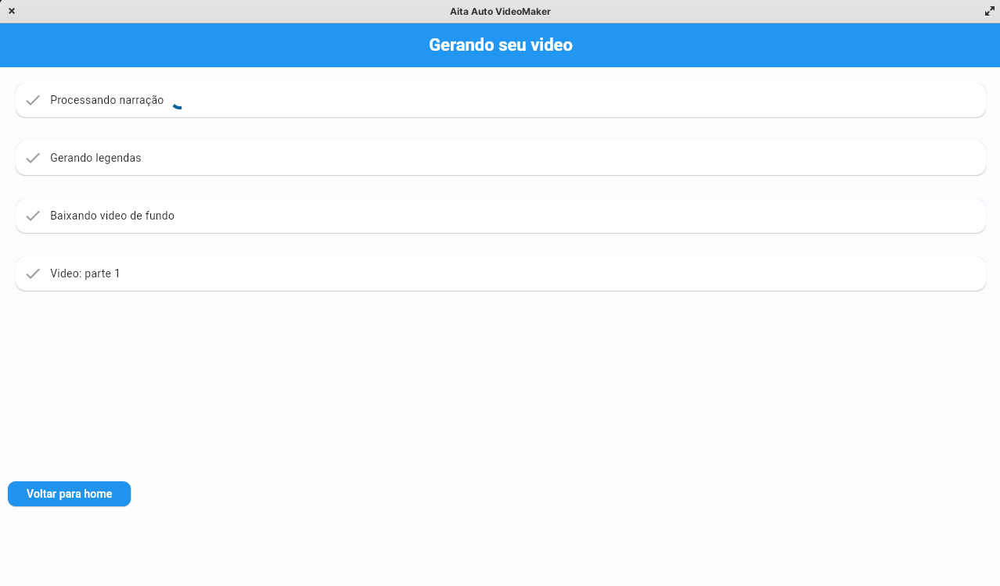
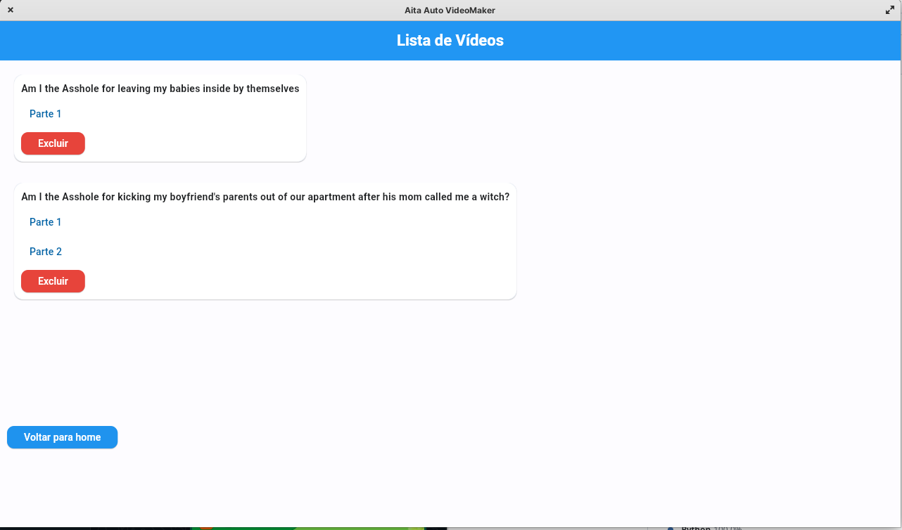
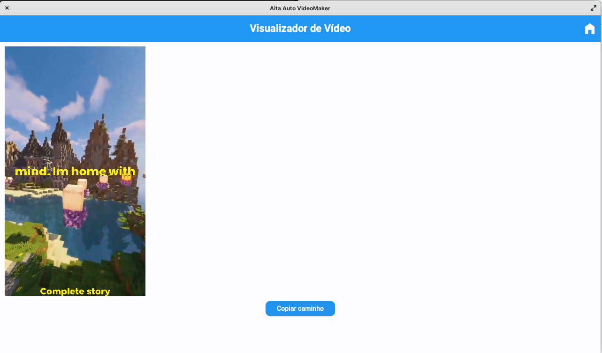

# AITA Video Maker

Este é um script Python para criar vídeos automáticos com histórias de vários subreddits (incluindo "Am I the Asshole?" (AITA)) do Reddit.

  - A geração de audio usa a AWS Polly.

  - As legendas são geradas através da Assembly.ai

  - Não há correção de texto por padrão, mas alguns erros na geração do texto provocadas pela PRAW são minimizadas através de NLTK

Credenciais de acesso (API keys) a AWS, Assembly.ai e Reddit sáo necessárias (todos os serviços tem tiers gratuítos generosos)

## Novidades

Agora o Aita VideoMaker conta com uma interface gráfica feita

## Funcionalidades

- Baixa vídeos do YouTube para serem usados como background.
- Gera narração automática a partir das histórias selecionadas.
- Formata os vídeos para o formato TikTok (9x16).
- Adiciona legendas e divide os vídeos em segmentos dependendo da duração estimada do texto
- Exporta os segmentos com legendas para TikTok.

## Requisitos

- Python 3.x
- Bibliotecas Python:
  - assemblyai
  - blessed==1.20.0
  - boto3
  - contextualSpellCheck
  - contextualSpellCheck
  - flet
  - lxml
  - moviepy
  - mysmallutils
  - nltk
  - playsound
  - praw
  - pysbd
  - setuptools
  - spacy
  - tqdm
  - yt_dlp


## Instalação

1. Clone o repositório:

   ```bash
   git clone https://github.com/rammyres/aita_auto.git
   cd aita_auto
   ```

2. Instale os requisitos:
    ```bash
    pip install -r requirements.txt
    ```
3. Instale o ffmpeg e o Image Magick (de acordo com sua distribuição)
    - Debian/Ubuntu 
    ```
    sudo apt install ffmpeg imagemagick
    ```

    - CentOS/RedHat
    ```
    sudo yum install ffmpeg ffmpeg-devel ImageMagick ImageMagick-devel

    ```

    - Arch Linux
    ```
    sudo pacman -S ffmpeg imagemagick
    ```

    - OpenSUSE
    ```
    sudo zypper install ffmpeg-4 ImageMagick
    ```

    - Gentoo
    ```
    sudo emerge --ask media-video/ffmpeg 
    sudo emerge --ask media-gfx/imagemagick
    ```

4. Execute o script main:
    ```sh
    python main.py
    ```

Na primeira execução serão configuradas as credenciais Reddit, Assembly.ai e AWS

## Outras configurações
O script possui listas de palavrões (config/profanities.json) e siglas (config/acronyms.json) que podem ser ajustadas para correção automática do texto. 

Há também uma lista de videos do youtube (config/videos.json) para plano de fundo (sem copyright ou comentários, com tempo minimo de 3 minutos), que também pode ser ajustada de acordo com a necessidade.

As vozes em config/voices.json são uma questão pessoal, mas todas as vozes disponíveis podem ser utilizadas. 

## GUI 

A interface gráfica pode ser acessada usando o seguinte script:
    ```sh
    python gui.py
    ```

Todas as funções da versão em modo texto estão disponíveis, incluindo funcionalidades novas como:
  - Edição do texto da postagem antes da geração da narração
  - Edição das configurações
  - Prévia dos videos gerados 
  - Cópia do caminho dos videos gerados a partir da lista de videos disponíveis

  ## Screenshots
  
  
  
  
  
  
  

